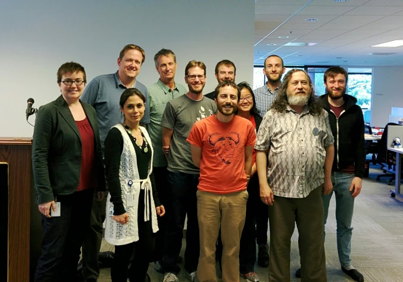

---
tags:
  # - post
  - community
  - work
  - tech
title: A Visit from Richard Stallman
---
When I was working at [The Public Library of Science](https://plos.org/) (PLOS), one of my co-workers ran into [Richard Stallman](https://en.wikipedia.org/wiki/Richard_Stallman) on the streets of San Francisco - presumably flown in to give a talk at some local conference.

Somehow my co-worker talking him into giving a talk at PLOS. After all, our mission (making science/research free and accessible to all), is somewhat parallel to the mission of the [The Free Software Foundation](https://www.fsf.org/) (defending the freedom to [run, edit, contribute to, and share](https://www.gnu.org/philosophy/free-sw.html) software).

I have seen him before, and unlike others, I appreciate his eccentricities. So it was a joy to have him come talk at my place of work.

