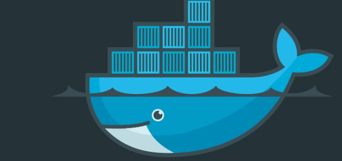

---
tags:
  # - post
  - work
  - tech
  - docker
title: "Post: Testing Made Awesome With Docker"
---

_This was a post I wrote for the [PLOS tech blog](https://web.archive.org/web/20170608215050/http://blogs.plos.org/tech/testing-made-awesome-with-docker/). I later started writing [a book with the same title](https://leanpub.com/u/jonocodes), but eventually moved on to other projects before finishing it._


As PLOS has grown (in users, articles, and developers) we have put a lot of effort into splitting our original applications into groups of services. My team is responsible for several web services. We have worked on finding open source tools that can help us and the other PLOS development teams across our growing service ecosystem. I would like to tell you about one of our favorite new tools: Docker.



[Docker](https://docker.com) is an open platform for developers and sysadmins to build, ship, and run distributed applications. For our purposes Docker containers give us access to a jailed operating system that any of our services can run in with almost none of the overhead of a virtual machine.

The many uses of Docker are still being realized and the broader community continues to determine what the best practices are. It is not just used by operations and development. For example, [Melissa Gymrek wrote about using Docker to support reproducible research](http://melissagymrek.com/science/2014/08/29/docker-reproducible-research.html), and used a PLOS Genetics article as a test case.

Less then a year ago I used Docker on a couple projects which I thought may help with cross team development. We liked Docker, but were not ready to take it to production. Around the same time, our team was without any QA bodies, so us developers had the opportunity to setup our own testing plan. As we thought about it, Docker seemed like a perfect fit for what we needed. We creating test environments that mimic production using Docker containers and quickly found that Docker makes it easy to narrow the gap between production and development.

## Consistent Environments

With [Dockerfiles](https://docs.docker.com/reference/dockerfile/) we can define an exact template for what each application needs, from operating system to libraries to open ports. In the git repository for each of our projects we can include a Dockerfile right along with the source code. This way anyone who pulls the project can get it up and running with a few simple commands. They don't need to install all the dependencies manually and hope it works on their own computer, since this will all be taken care of in the Docker container. This means getting up and running is fast since the host machine requires nothing installed but the Docker service itself.

Docker containers are so lightweight that it is beneficial to run only one application per container. Since your application very likely has dependencies on other services (database, caching server, message queue, etc), you will need multiple Docker files to bring up a working stack. This is where Docker Compose comes in.

[Docker Compose](https://docs.docker.com/compose/) gives a way to bring up a collection of containers. In a short yaml file we can define our entire stack. With a 'docker-compose up', our entire stack is up and running in few seconds. Here is a sample compose.yml file:

  
```yaml
web:
  build: webserviceapi    # location of our Dockerfile
  volumes:
    - ../target:/build    # share directory to get compiled build from
  links:
    - database:database   # network link between containers
  ports:
    - "8080:8080"         # expose port 8080 to host

database:
  image: mysql:5.5        # name of community a supported image
  environment:
    - MYSQL_ROOT_PASSWORD=verycomplexpassword
 ``` 

## Black Box Testing

Our web service container exposes port 8080 so it can be reached from the host. To run our API integration tests all we have to do is point them at that port, and we are testing the Dockerized API instead of a service running directly on the host. I wrote a few small scripts that orchestrate bringing those containers up and down as needed between various tests and now we have a very fast and comprehensive integration testing system.

## Scalability Testing

You can use compose to bring up any number of instances of the services in your stack with something like:

> docker-compose scale web=10 database=3

This is great for testing things like database clusters or load balancers. I have seen hundreds of database containers run on a single laptop with no problem. Try doing that with a virtual machine.

## Configuration Testing

It is easy to add very invasive automated tests here as well. Let's say we want to automate the testing of different system configurations. We usually use MySQL, but this service also can work with a Postgres backend. This test can be added in a few minutes. Just create a Postgres container ([or find an existing one on Dockerhub](https://registry.hub.docker.com/_/postgres/)), and modify our test script to run as follows:

- Bring up new stack (with MySQL backend), seed with data, Run API tests, Tear down stack.
- Bring up new stack (with Postgres backend), seed with data, Run API tests, Tear down stack.
- Report on any differences in test results between MySQL and Postgres backends.

## Simplifying Development

In the past, some of our system tests used a different database technology than the production deployment. These tests used in-memory H2 databases since it is faster to bring up then a full database server. This has given us problems since we need to manage drivers additional specific to testing, and [H2's compatibility mode for MySQL only implements some of the MySQL feature set](http://h2database.com/html/features.html#compatibility). Since Docker allows us to quickly create production-like systems we have completely removed H2 and test right on a MySQL container. Now that we have fewer dependencies, we have less code, and fewer points of failure.

## Simplifying Testing

Now that our stack is Dockerized, anyone can easily run the tests. New developers can run tests against their new code right away, leading to fewer checked in bugs. And QA can focus on tasks beyond regression testing.

Speaking of QA, we don't need special servers that only QA has access to. Anyone with Docker installed can not only run the whole application stack but can run the full test suite. The same minimal requirements are in place on our continuous integration build server. We don't need to take up any public facing ports. When the build finishes, it brings up a whole stack, tests it inside the local machine, and tears it down. Did I mention the overhead to run these tests against a brand new full stack is only seconds! I probably did. But its worth saying again.