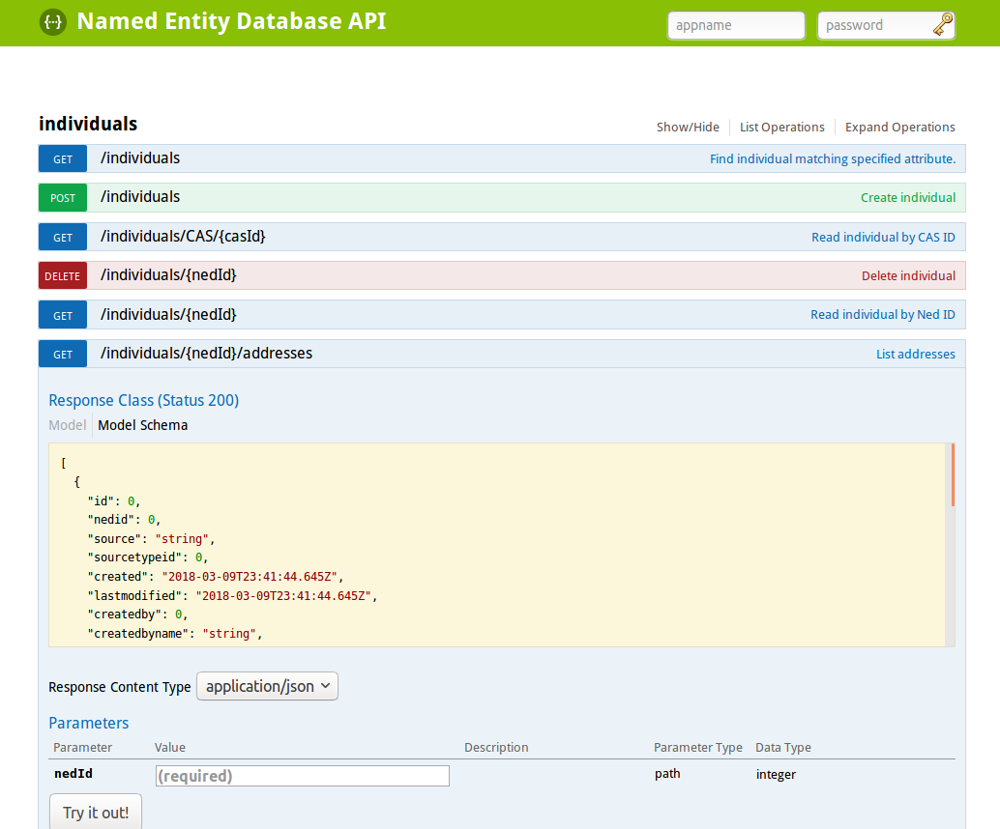

---
tags:
  # - post
  - tech
  - programming
title: Supercharging your API with Swagger
---
_This was a post I wrote for the [PLOS tech blog](http://blogs.plos.org/tech/supercharging-your-api-with-swagger/), which is no longer online._

If you manage, develop, or use REST APIs I have a tip for you. [Swagger]([https://swagger.io/](https://swagger.io/)) is a framework and toolset that greatly eases the pain of documenting and interacting with your APIs. It's a swiss army knife for all things APIs and in this post I'll explain why and how it makes APIs more enjoyable to work with.

We have quite a few APIs here are PLOS. Some are internal, some are exposed to the world. We have APIs for article content, authors, readers, manuscripts, taxonomies, configuration, metrics, reviewer matching and more. They are developed with a breadth of technologies including Java, Python, and Ruby.

Keeping track of how all these APIs work is quite a task. Back when we only had a single API we had it documented in a Wiki. As the API grew, the maintenance cost of that document also increased. As we started splitting our mega service into smaller ones, we needed a better way to keep our documentation up to date. Swagger did that and so much more.

At its core, Swagger uses the OpenAPI specification which is a machine readable description of your API. It typically looks like a large JSON or YAML file. The spec itself is not too interesting, but the tooling around it makes the spec incredibly powerful.

For example, one of our [internal APIs](https://github.com/PLOS/named-entity.service/) implements a well defined [Java REST specification](https://jersey.github.io/). We use a [library provided by Swagger](https://github.com/swagger-api/swagger-core/wiki/Swagger-Core-Jersey-2.X-Project-Setup-1.5) to autogenerate the swagger spec into JSON from our API. This spec is regenerated every time our project is updated and hosted in a special namespace of our API.

Now that we have a spec, we use the [Swagger UI tool](https://github.com/swagger-api/swagger-ui) which is simply an HTML/Javascript page that parses the spec and displays it as readable documentation. The documentation is not static though. You can actually interact with it and perform API calls through your browser with it . We deploy these interactive docs with our service and it helps our consumers a lot.

We have done almost no work and our API consumers are greatly benefited. But it doesn't stop there.

We have many APIs and we also have many apps that use those APIs. The consumer apps can also make use of the spec. [Swagger code generators](https://swagger.io/swagger-codegen/) parse the spec and generate client libraries for us. This way our apps don't have to know about REST at all. They just load a client library and interact with it like an object. The generators support dozens of languages and frameworks out of the box. You can extend them or use one of the hundreds of [community driven ones](https://swagger.io/open-source-integrations/).

Want a command line tool that can tap into all your APIs at your organization at once? The generators can help with that too.

That is most of how we use it at PLOS, but Swagger can do much more. For example you can write an OpenAPI spec and use a code generator to create scaffolding for a new API. Or even mock parts of your API.

Additionally the community behind swagger is an open group of API enthusiasts. I have found that most of the problems I might have with APIs they have solved, or are working on it.
