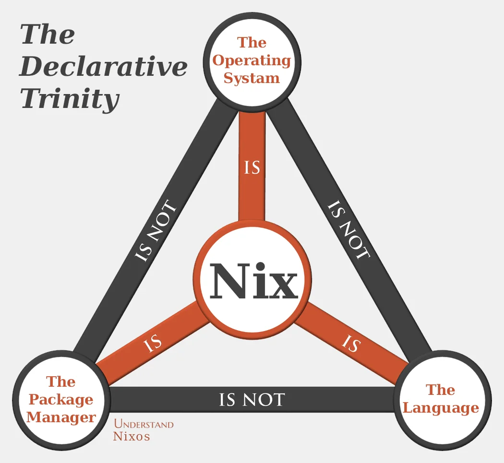
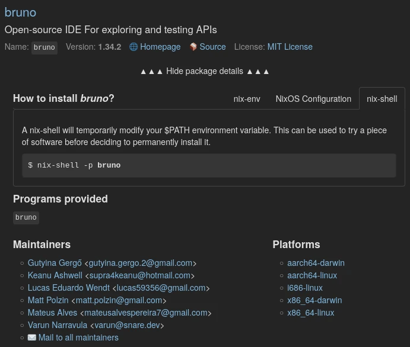

---
tags:
  # - post
  - tech
title: Nix - Death by a thousand cuts
---
This is my perspective on using [Nix](https://nixos.org/) (the OS, the package manager, and the language) as a main driver for the past 2 years. I have [gone to conferences](https://www.socallinuxexpo.org/scale/21x/nixcon-us), [engaged the community](https://app.element.io/#/room/#nixnerds:jupiterbroadcasting.com), [donated](https://opencollective.com/nixos#support), [submitted bug reports](https://github.com/NixOS/nixpkgs/issues?q=is%3Aissue+author%3Ajonocodes+), converted my home servers, and probably spent hundreds of hours in Nix configs. I consider myself well versed, but certainly no expert.

TLDR: In its current state (2025), I don't generally recommend __desktop__ use of Nix(OS), even for seasoned Linux users.



I had tried Nix several times [over a decade](https://github.com/NixOS/nixpkgs/issues/12757), and two years ago I again went all in on my general purpose desktop. My use is not too complex. I have decades of software engineering and devops experience, and was hoping to encode my needs with Nix configs. There were many ups and downs in the process of making NixOS work, but in the end I could never really get ahead of/with Nix. I spent so much time cobbling together hacky configs that when I step back and look at the house of cards I have built, it is apparent Nix has created more problems then solutions for me.

Many of us have grappled with [the sunk cost fallacy](https://en.wikipedia.org/wiki/Sunk_cost#Fallacy_effect) as we address our love/hate relationship with Nix. It's hard to know when to quit, so I wrote this tear filled break up to give me some closure. [Pun intended](https://nix.dev/manual/nix/2.17/command-ref/nix-copy-closure).

To be clear, I love Nix and have learned a lot from it. I am not giving up on it, but its time for me to take a break and scale back my all-in attitude.

## The Good

### Declarative configuration

What always intrigued me about Nix was its hermetic, reproducibly. In a perfect setup, I can define my whole system in a single succinct config file and know that I will get that exact system and nothing more whenever I build it.

A great example of its use is when I was going to a conference and needed to bring a laptop. I had two laptops at home, running Nix. The more capable one was serving some files in my network. The other one was was for taking notes on, but at the time was having batter problems - so not great for working outside the house.

So I simply swapped the Nix configs on the two machines - just for a week. This allowed me to keep a server up at home with the same services/dns/etc as before, while being able to bring a working laptop to the conference.

This was so easy - I could not have dreamed up something like this before Nix.

A good config is beautiful. You can simply define your hostname, timezone, X settings, mount points, shells, and basic services (ie - networking, ssh, printing, virtualization, firewall).

### Dot files

Elaborating on the previous point, user config with home-manager is very nice. Setting groups, shell, git config, ssh client configs is a breeze. But you probably have a bunch more then that like settings for various apps (ie - Thunderbird, editors/IDEs). 

My old solution for these was syncthing and a handful of [symlinks](#symbolic-links), but dot files are even simpler to manage in Nix.

### Simple services

This is where the power of NixOS really shines. Need to run a database? A web server with SSL? A sound service? These mostly can be done with a single line or two in your config. When you first experience bringing up a service like this, Nix feels like magic.

I think the sweet spot is a machine running under 10 services, like [a mail server](https://nixos-mailserver.readthedocs.io/en/latest/index.html), a [NAS](https://danielunderwood.dev/post/nixos-nas/), or [nextcloud](https://www.jupiterbroadcasting.com/show/linux-unplugged/549/) because each of these require a small set of services that could be encapsulated well on a single box. Formerly, to do this, I would choose any base Linux system and create a docker compose file.

The advantage over docker here is that (when using Flakes) Nix builds are completely reproducible. Docker containers may be isolated, but surprisingly they are not deterministic out of the box. With some work you can make docker deterministic, but thats what you need, its much easier to use Nix.

Side note: There are ways to get [both the benifits of Nix and Docker](https://xeiaso.net/talks/2024/nix-docker-build/).

### Ephemeral shells

[nix-shell](https://nix.dev/manual/nix/2.18/command-ref/nix-shell) and its variants are real super powers. It lets you drop into a temporary environment and setup whatever you need - programs, configs, environment vars, files. When you exit that shell it cleans up in a way that none of that stuff ever existed. Great for trying ideas, system changes, and even regular software development.

Also, a shout-out to [nix run](https://nix.dev/manual/nix/2.23/command-ref/new-cli/nix3-run) which allows you to run programs without "installing" like so:
`nix run nixpkgs#gimp`

This makes it so I can run any program without having to pull updates for it when I build my system. I find this particularly useful for larger programs that I depend on, but rarely run. Features like this really make you rethink how you can architect interesting systems in a way that was not possible before Nix.

## The So-so

### Major version upgrades

My top level flake contains:

```nix
nixpkgs.url = "nixpkgs/nixos-24.11";
nixpkgs-unstable.url = "nixpkgs/nixos-unstable";
```

When version 25.05 is released, I simply update the url and rebuild. Then I typically need to deal with a few upgrades that the build tells me to. And viola, a new major version.

Also the ability to mix and match versions is powerful. For example I have some packages using 'unstable' and some using the above stable version. You can get more granular as the need arrives.

But this does not work for everything. When in NixOS 23.11 I wanted to try KDE 6 but it was not so simple. I would have to do some [channel fu](https://discourse.nixos.org/t/enable-plasma-6/40541) to make unstable the default instead of just using unstable for KDE, and stable for other packages as many of us do.

### The Community

NixOS is very much a community supported distribution made of technical users. I would be surprised if the even the non-technical community engagement and marketing teams don't dream in Nix derivations. This is unique to Nix. My guess is no more then 5% people working at Ubuntu could create a .deb.

I find the community to be helpful and enthusiastic. Between discord and matrix rooms I have gotten good help on multiple occasions. In my experience they are very willing to get new user going or fix your faulty module, but at a certain point you are expected to be diving into code.

The up-side of this is that it encourages a steady inflow of PRs. Many from users who are just getting their feet wet. But a distro where everyone is a contributor is going to turn off a lot of users. If it were not for this, I think the Nix community could grow much larger.

Though the community is doing quite well these days. Aside from the [political turmoil](https://www.reddit.com/r/NixOS/comments/1cjbt6l/2024_nixos_crisis_tldr/) which drove many core contributors away in 2024, I think Nix has been continuing to stabilize - which is great. At this point I'm much more concerned about [ongoing server costs](https://www.socallinuxexpo.org/scale/21x/presentations/nix-state-union-2024) then a fractured community.

### github

The use of github has been both a boon and a crutch for me. I like how I can create pull requests, comment on discussions, watch issues, and request upgrades in a single public space. However it can get messy - for example in the AUR there is a [single page that logs all the discussion on a package](https://aur.archlinux.org/packages/python-pdm-pep517). There you can see how upvoted/trusted the package is, the alternatives, if it is deprecated, if there are common workarounds, if it is being worked on. There is not central place in nix to discuss a single package. You just have to search for it and go through the dozens of bespoke conversations about it. I don't fault Nix for this. This is just do to the use of github for package discussions - as arch created their own app for package discussions.

I also spent a lot of time searching github for nix derivations that fit my immediate needs. I wish I did not have to do this, but it is an invaluable resource.

### Variability of supported packages

One of the selling points of Nix is that Nix can both install and configure programs. Many programs are setup with amazing configurability in Nix. These is the case for widely used ones like openssh and syncthing. Their config options are extensive and well documented.

But other's only give cursory setup options. For example duplicati and rclone are widely used programs, but their Nix integration could use some love. Both have some options, but if you want them to have declarative configs, its time to roll up your sleeves and get dirty.

This is why I have a notes file that enumerates all the manual steps I need to take to bring up that system with things like:
* setup firefox sync
* install docker plugins
* samba credentials

If you really want a pure portable config, its doable but you will have to put in the time and pay the _Nix Tax_.

The problem here is that for things to work consistently, the more they are nix-ified the better - which takes a lot of time and work from contributors. So learning the Nix way is not sufficient for your systems. You need to know Nix and also the underlying config systems for many programs - let it be ini files, dconf, or etcd. Again, this problem is unique to Nix since it comes with the power of configurability - which is generally a useful feature not provided by non-Nix systems.

### Granular package control

Sometimes a new release of a program does not work well, so you want to prevent that package from upgrading. The Nix solution for this is to create a additional reference to the whole nix packages repo at a certain checksum. Then have the package source that.

In pacman based distros I can just rollback a package to an old version in my cache and tell pacman to ignore upgrades on that package.

The Nix way is not terrible, but package pinning contributes to the cruft that will inevitably accumulate in your configs.

The same goes for the other direction where I just want to upgrade a single package. In Fedora I would just run

```bash
dnf upgrade vim
```

Perhaps you can do something like this by mucking around with the _flake.lock_ file, but I'm not sure how.

### Rollbacks

It seems very cool that you can roll back in the case of a catastrophic upgrade failure, but has that every happened to you? Not me. Usually the failure happens at build time, not after.

And even if the failure happens after build, I find it better to fail forward and fix the problem or remove the broken package then rolling back the whole system.

## The Bad

First off, I am well aware that some of these issues mentioned below are likely exacerbated by my own faults.

I have been using Linux every day for everything since it began in the 1990s. I love to distro hop, but Nix is like no other. It's very much an abstraction layer on top Linux. It's possible that the fact that Nix is always "in the way" between me and Linux, it may have soured me.

I'm on the fence is Nix is better for experienced or new Linux users. But this point is driven home when I find at Nix conferences a bunch of high-schoolers who package Nix derivations for fun. Perhaps I'm not the best developer, or maybe my experience is whats actually in the way.

Also the fact that I don't like the Nix language may be due to my middle aged brain being hard to teach new tricks? I don't know.

### Too many ways to do the same thing

At this point NixOS has been around for 2 decades, but it still feels like it has not settled on good recommended workflows for incoming users.

Using a Nix system often feels like using a [programming language](#the-language). There are many ways to do the same thing, different philosophies, old ways, new ways, etc. And you need to dive deep just to figure out basic day to day things like enabling a browser extension. But wait, there are several ways to do that. And each extension may work better with one method or another.

[github](#github) has been an invaluable resource for discovering how people are getting things done. People love to share their configs and it is a great way to learn what can be done. Nix closures are atomic beauties that can be deterministically copied and pasted, right? Well, sometimes yes.

But not always. Why? Because there are so many ways the context can vary as everyone is doing different things. Is that config you found:
* using NixOS via [programs.package](https://mynixos.com/nixpkgs/option/programs.ssh.package) or the [Nix package manger](https://mynixos.com/nixpkgs/package/openssh). Or are both required?
* are they using [home-manager](https://mynixos.com/home-manager/option/programs.ssh.enable), or [nix-darwin](https://github.com/LnL7/nix-darwin/blob/6a1fdb2a1204c0de038847b601cff5012e162b5e/modules/programs/ssh/default.nix), or nix-darwin with home-manager?
* are they using a legacy [user profile](https://nix.dev/manual/nix/2.22/package-management/profiles)?
* or is this happening in a [devenv](https://devenv.sh/reference/options/#packages)?
* are they using [flakes](https://wiki.nixos.org/wiki/Flakes) or is this a configuration.nix?
* were flakes introduced via the [determinate installer](https://determinate.systems/nix-installer/), or [some other starter template with its own opinions](https://github.com/juspay/nixos-unified-template)?
* does this depend on some custom [overlay](https://nixos.wiki/wiki/Overlays)
* or perhaps they had to wrap this with the [File System Hierarchy](https://ryantm.github.io/nixpkgs/builders/special/fhs-environments/) shim?

And when I've exhausted all my options I find myself turning to ChatGPT to straighten things out. Sometimes its helpful but like most things it ends up producing the same spaghetti was was dealing with in the first place. Garbage in, garbage out.

### Space, Bandwidth, Resource use

The hermetic nature of closures, require very large downloads. Its not uncommon that my daily update will bring down 500mb - which the size an entire distro install. This is not really a problem for my setup as I have a fat pipe connection and any reasonable drive is big enough, but it feels like overkill.

Supporting low bandwidth connections would be great. Not just for communities with limited infrastructure, but also for when you are not home, or at a friends house with a download cap perhaps. And you don't want to exhaust their allotment. Well, there are a bunch of cases.

When I hear people complaining about the bloat of runtimes that come with running snaps or Flatpaks I think Nix is like that times 10. Of course the self contained nature of Nix packages are part of its selling point.

Remember, it was not long ago that SSDs had a limited amount of writes. Is it unreasonable to think that a small update to Vim and Thunderbird cause regular large disk writes? Maybe I'm missing something, since I have not seen others raising these concerns.

One of the last servers at home I have not converted to Nix is a Raspberry PI running stock Raspian on an SD card. That machine has been running for a long time and only serves a handful of static files, but even that causes enough bad blocks on the SD card that I need to replace it every year or two. How much would Nix updates thrash that storage? And how large of a card would I need to get in order to not have to garbage collect every day?

To reduce write pressure I've looked into PXE booting and [Impermanence](https://github.com/nix-community/impermanence), but the software updates them self negate the wins.

I have a beefy machine (16 cores, 64gb ram) but, every once in a while (perhaps there is some package not hitting the nix cache, and compiling from source) a build grinds my machine to an unusable state. At which point I need to drop everything and dig into [resource limiting][https://nix.dev/manual/nix/2.24/advanced-topics/cores-vs-jobs] to keep my machine usable, but in the end will only slow my build time.

Inevitably I need to run the build a bunch of times before it gets it right, at which point github starts throttling me. This has never caused to much of an issue, but the fact that I need to go generate API keys for a git account just to update my read-only packages also feels like overkill. I'm not sure why a CDN or local cache cant solve this issue - but that's another rabbit hole to explore.

Speaking of CDN, have you looked at [the amount of storage/bandwidth needed in S3 to host the Nix repos](https://www.socallinuxexpo.org/scale/21x/presentations/nix-state-union-2024)? It's tremendous and a major cost burden for the Nix Foundation. I think distros have historically solved this with community mirroring and torrents perhaps? But for technical reasons I'm not sure this is even possible with Nix's build requirements.

### Package selection

Nix boasts that is has more packages then other distros, and I chalk this up mostly to the very enthusiastic Nix community. While the quantity of packages is impressive, the quality can often be lacking.

This shows its head in [the variability of supported packages](#variability-of-supported-packages), but also across distribution branches (ie - stable vs unstable).

If you want more of a rolling experience, then favor stable for most of your packages. But that branch name holds true. For each package that is not working I need to downgrade it to the stable release version. This is a non-stop wack-a-mole for every package.

Whats more, even the _unstable_ repo packages lag behind other distros. I regularly find [packages that are years behind the upstream source](https://github.com/NixOS/nixpkgs/issues/325622). Often Flatpack versions are more ahead of unstable. And then you have the AUR, which I find to be both more current and more stable. Part of this may be to the very thin wrapper that [PKGBUILD](https://wiki.archlinux.org/title/PKGBUILD) provides. In my experience this means app problems are always upstream, and not in the packaging. In Nix it is often the opposite - or much harder to tell.

### Documentation

The central decimation for NixOS has a lot of potential. They are often simple and fairly up to date. Sometimes there is a just a single line you need to add to your config, and you are off to the races.

But don't let the simplicity fool you. They often presume fairly good knowledge of Nix and that you may not mind writing your own closures or [overlays](https://nixos.wiki/wiki/Overlays). 

When I come upon an [Arch document](https://wiki.archlinux.org/title/Java) I interpret it as: "If you use command X, you will have Y working with Z features." If those instructions don't work, I am quite surprised.

When I read a [Nix doc](https://wiki.nixos.org/wiki/Python) I read it as: "Here are some things that worked for me, and here is something that worked for another guy (link to outdated blog post)." Then I try to cut and paste what I find there. If I'm lucky, some part of it may work. See: [too many ways to do the same thing](#too-many-ways-to-do-the-same-thing).

### The Language

I often find functional languages are nice but mostly in a theoretical way. Once I try to build something extensive with it, its rigidness starts to get in the way. I'm impressed when I see something like a complex web application written in OCaml or Haskell.

That being said, as far as functional languages go, I thin Nix is particularly hard to follow. I do like how Nix is well suited to encapsulated deeply nested configuration variables, but that's about where it stops. I don't appreciate the logic and structure, and having to learn a brand new language before you can even turn the machine or send an email rubs me the wrong way.

One thing I think that would greatly help is something like a Nix language server that could help you autocomplete in your IDE to see what the available options are for a program. Instead of stumbling through various online docs/discussions that are in different states of disrepair. The closest I have been able to get to this is using VSCode with [Nix IDE](https://marketplace.visualstudio.com/items?itemName=jnoortheen.nix-ide) and [Nil](https://github.com/oxalica/nil?tab=readme-ov-file), but I understand it is a hard problem.

I do like how [Guix uses Guild](https://www.gnu.org/software/guile/) and does not reinvent the wheel here, but the community and maturity of the ecosystem is not far enough along for me to invest in it.

### Build errors

I'm not going to get into this too much since it is mentioned a lot. Nix build failure messages are notoriously cryptic. Like any programming language, you get to know them after a while, but they will only get you so far.

You can find endless discussions online asking how to debug various failures. Nix provides a handful of utility functions for [trace dumping](https://github.com/NixOS/nixpkgs/blob/3be90b9f3ac249c7fad58d9a6c89eff708223394/lib/debug.nix), but say you really need to dig in with a [breakpoint](https://nixos.wiki/wiki/Error_handling) or something - good luck.

### Using new tech

Want to try a new program that's all the rage on [HackerNews](https://news.ycombinator.com/item?id=42517447) today?

Do a git clone and try to follow the project build instructions. If you are lucky, they are using golang and [provide a single compiled binary](https://github.com/faan11/flatpak-compose/releases/tag/0.4.1).

But, no they are probably using Erlang or something you need to compile, so its time to learn how to build a Nix shell that will give you the requirements of that project. Did you really want get that deep into it to find that you don't like the project you downloaded? Probably not.

Perhaps you are lucky and they even include a [nix flake that the developer uses](https://github.com/ghostty-org/ghostty/blob/ff50b5539efc343fa69dac97e1449a75c89141f5/flake.nix)!

Or maybe you google around and find some third party [hacked something together](https://github.com/KenMacD/etc-nixos/blob/ad44a09f82e6774768ed83b8e2aacc28050b800e/pkgs/windsurf.nix) already to run that package. Looks good, but hopefully it will be compatible with your setup. See [too many way ways to do the same thing](#too-many-ways-to-do-the-same-thing).

Maybe you want to try a module not in the official nix repos. There are a ton of formulas you can find online. But they presume a good amount of Nix knowledge. Like [this one I was using yesterday](https://github.com/GermanBread/declarative-flatpak/blob/b88bd5b65f8e7c35eec0a90cfd6e096b2e7f79c0/docs/home-manager.md). It shows you how to enable the feature (Flatpak support), but not how to actually use it (install Flatpak packages). You can dig through the code, or if you are lucky they included some tests that cover your case.

### Messy configs

I'm [fairly serious about note taking](https://johnnydecimal.com/), and I find this particularly necessary with Nix since there are [so many ways to do the same thing](#too-many-ways-to-do-the-same-thing). When I give up on a problem, I often come back months later and try to take a stab at it. Without my notes, I would end up trying and failing the same way again.

Some of these notes are in markdown files and some are directly in the configs to keep them close to where they belong.

If I had a nickle for every NOTE and TODO in my Nix configs, I'd be rich. For example I never quite got Firefox extensions working well in my configs. I can see several attempts commented out in my configs. Why? Because I really want it to work, but at some point I had to move on to other things. Maybe its my refusal to give up.

Or I find 4 different tries of setting an environment variable that a certain app can read. My goal being to keep the variable somewhat local to the app, but I had to eventually set it globally and get on with it.

Of course there is a smattering of comments like: "# not sure why I needed this line, but I cant get CUPS to work without it", but you could find that in a lot of projects where you are not a domain expert.

Sometimes being able to comment in Nix configs are really quite useful. For example I have several programs that I like to install only when I need them for a while. Like I will use Xournal++ to edit and sign PDFs, but that may only be for a couple weeks when I'm doing my taxes. So I can comment those out and describe what they are for when I come back.

Speaking of hectic configs, its common to find cryptic incantations throughout like this one:

```nix
# App image support
boot.binfmt.registrations.appimage = {
	wrapInterpreterInShell = false;
	interpreter = "${pkgs.appimage-run}/bin/appimage-run";
	recognitionType = "magic";
	offset = 0;
	mask = ''\xff\xff\xff\xff\x00\x00\x00\x00\xff\xff\xff'';
	magicOrExtension = ''\x7fELF....AI\x02'';
};
```

Its gotta go somewhere, but it ain't pretty.

### Development environments

Both my day job and passion projects are software development. Nix's isolated shell environments seem like a great silver bullet solution to having bespoke projects with different needs throughout a shared system.

Historically I often find myself creating development specific Docker containers to encapsulate a project's needs to solve this same problem, but Nix's promise is much cleaner.

The thing with development is its all about joining various technologies together - be it services, languages, contracts, libraries. And of course each of those have their own requirements. So setting up a development environment is not trivial. Its not as simple as, use this Rust config for your Rust project. There is always that one library that requires a weird complie flag, and one that requires Ruby for some weird reason, and a very specific patched version of the caching service. You need to figure this all out - weather you created the project in the first place or not.

So development environments are rarely straight forward. This is very much the same problem as [using new tech](#using-new-tech). You can make a great nix environment that works for a while, but don't be surprised that when you add a new code dependency you end up having to crack open the nix config and see why everything is failing. You were already doing this for your Rust build system, but now you also need to do it for your Nix environment.

There are many projects that have tried to solve this problem and I have tried a lot of them: [nix develop](https://nix.dev/manual/nix/2.24/command-ref/new-cli/nix3-develop.html), [devbox](https://www.jetify.com/devbox), [flox](https://flox.dev/), and [niv](https://github.com/nmattia/niv). My favorite has been [devenv](https://devenv.sh/) and I use it every day. It is widely used and ships with [its own supporting services, like ephemeral databases](https://devenv.sh/supported-services/mysql/), but even getting those things to work involves learning devenv's own abstractions instead of Nix's ones.

Even with devenv, there are times that the environment breaks and I cant get any work done. Once I spent a couple days setting up a [docker dev environment](https://docs.docker.com/desktop/features/dev-environments/set-up/) just to get back up and working again for my job. Yes, I think dev environments are kind of clunky, but at least I can use well documented tools for it that [can be debugged](#Handling-Build-Errors). And in the end I can share it with my co-workers because they are not using Nix.

Then there is the desktop integration. A typical workflow for me is to use Gnome to launch PyCharm. Then in PyCharm I tell it where my python environment is, but that is no easy task when Nix is in the way. You can try various and plugs and workarounds, but in the end the most consistent way is to open a terminal, then start the dev environment, and then launch PyCharm from there. Not sure why this bugs me so much, but oh the hours I spent trying to get this right.

It really brings home the point that if you don't surround everything in Nix, you will be in for trouble.

### Legacy cruft

Early on when I was experimenting with Nix on various systems I installed nix-darwin on my work Macbook.

I started looking through the repo for the packages I wanted to swap out from brew. I was surprised to see all the programs I needed were found in my searches. Very cool. Didn't realize aarch64 darwin was so widely used.



But, no. I tried to install these things and got messages that they are not available in my architecture. Ok, maybe I was searching wrong? When looking into this discrepancy I found this was a known quirk left to support some legacy search system.

How was I to know this? And how was I supposed to discover packages I could use without trying each one and watching them fail? This was one of my earliest experiences engaging the Nix community - and they were very helpful. But I should have seen it as a [red-flag in regard to Nix's maturity](#Desktop-integration).

Side note: The escape hatch that got things working for me was [nix-darwin's homebrew options that allow me to somewhat declaratively pull packages via brew](https://mynixos.com/nix-darwin/options/homebrew).

## Examples

Here are some examples of things I have run into over the last couple years. None of these themself are catisthropic, and maybe I'm dense, but these go to show there is a rabbit hold around every corner. Its never safe to get too comfortable.
### Desktop integration

I use a pretty vanilla Gnome setup. When I install a new desktop app, I presume I will see it in the list of applications. This is brought to us by XDG/.desktop files - which is a desktop standard.

The last time I spend a week in NixOS, I could not get these apps to relaibly associate. Sometimes I would have to log out. Sometimes I would have to full on reboot. Sometimes I would have to switch from Wayland to X or vide versa.

So I [filed a bug](https://github.com/NixOS/nixpkgs/issues/12757) and moved on. To me this was table stakes. If standard features like this don't work out of the box, it was a sign that Nix was not yet ready for desktop use. I'm a  [distro hopper](https://x.com/DistroStu), so this is no big deal. I will come back in a couple years and see where we are.

Years go by and I give NixOS a go again. I don't recall why I left but things are looking pretty good now. Then after a while I run into a similar issue - this time more related to user installed apps - not globally installed ones. So while digging through [discourse](https://discourse.nixos.org/) I find a lot of open discussion around the situation, and a handful of open tickets. And what do you know - my old ticket - still unresolved.

Side note: I also had some unrelated KDE issues that I could not get ahead of. Related to basic window management on virtual desktops.

### ZFS setup

ZFS on Linux has good pretty mature on Linux as of late so I thought I would give it a go. Typically I encrypt root as most systems do these days. The recommended way to do this is to use LUKS, not native ZFS encryption.

So I try to set this up - hoping that its not too much of a corner case. I was directed from the official Nix to download someones seemingly personal setup from their git repo. But the instructions there were quite opinionated and a bit out of date. Should I submit a PR to update things? Or should I file a bug report with the git user or who?

I kept a link to the git repo in case I ran into trouble down the line, but the account disappeared by the time I came back to it some months later. Thankfully my ZFS setup has been seemingly stable. I guess I should cross my fingers that nothing goes wrong there since the cut and paste incantation is magic as far as I know.

### Symbolic links

I use symbolic links fairly extensively for managing my dot files across all my machines. Its one of my favorite POSIX super powers. However in Nix, that kind of file structure is not really needed - as configs are internally managed in a nice immutable fashion.

The thing is I still need to use symlinks for some of these shared configs because not everything I run is 100% Nix. I don't think my Raspberry PI could even handle [the beast of the Nix package manager](#Space,-Bandwidth,-Resource-use). So I still want to use symlinks.

All this to say that Nix does not make symlinking easy, and you are very quickly looking for Nix escape hatches and peppering your configs with "impure" flags and statements. So I'm constantly reminded of my guilt as the Nix gods look down upon my sins.

### npm link

Speaking of [linking](#Symbolic-links), here is a development case that also bit me. I'm working on a [project](savr) that lives in a monorepo and contains a library that is extensively used by other sub projects in the repo.

In order to improve development I have used 'npm link' in the past. This is a facility that npm provides which internally uses symbolic links so you can develop on projects without having to constantly recompile the dependent library. Of course Nix was not happy with this, so I eventually gave up and tried other methods.

Fortunately during this research I discovered that modern npm natively supported workspaces which fit my use case well and did not depend on POSIX links. I guess I got a valuable learning experience out of that one at least.

### Conda

At my day job we use a fairly common python stack for the front end. Unfortunately it involves a combination of pip, pdm and conda.

The [Nix python docs](https://wiki.nixos.org/wiki/Python#Using_conda) make it seem simple, but getting it to agree with fish shell was not. Ok, maybe my use case is unusual?

I look around and find some Nix community conda implementations. Which are all over the place. I get farther with some then the others. In the process I noticed that the [official derivation is using a coda thats 4 years old](https://github.com/NixOS/nixpkgs/blob/edf04b75c13c2ac0e54df5ec5c543e300f76f1c9/pkgs/by-name/co/conda/package.nix#L34). 

So [I file a ticket](https://github.com/NixOS/nixpkgs/issues/325622), and it someone picks it up 5 months later. Meanwhile I am bouncing between several different dev environments depending on which features I need to work that day.

The Nix way of using conda is to use a "conda shell", which is like a new isolated session with all the conda goodies - much like a Nix shell. So now in every terminal, the workflow is:
1. start the nix dev environment
2. start the conda shell
3. activate the conda environment for my project

Now that I'm at level 3 of [Nix-ception](https://medium.com/@tanmaytheforcebewithyou/docker-ception-docker-in-docker-solved-a68d48a52ffa), I can start working. This is not terrible, but it gets old and I never had to do all these on other systems. And it continues to make [IDE use more difficult](Development environments). [direnv](https://direnv.net/) and [VSCode Nix Environment Selector](https://marketplace.visualstudio.com/items?itemName=arrterian.nix-env-selector) can only help you so much when you are in a shell, in a shell, in a shell.

I spent way too many hours trying to simplify this workflow, but in the end I just had to be content it worked at all.

### Using Gnome and KDE

I don't just like to distro hop, I also like to try new desktops. A few months back I wanted to compare the latest Gnome and KDE releases. In the past I just install both and choose them at login time.

But the way the Nix config handle display managers I was not able to have these two desktops enabled at the same time - without jumping through hurdles.

So I was left to make two separate configs with just a few differing lines - one for Gnome and one for KDE. Doing a rebuild/switch would only take a few seconds, but the fact that I had to edit my config every time I wanted to change desktops irks me. Isn't that the whole point of a display manager?

I also ran into similar issues when switching audio between jack and pipewire. There I could have them both installed at the same time, but I never got them to switch between eachother without modifying configs. Maybe this is just how this works these days - I don't know.

### Syncthing

I reply heavily on syncthing for data and configs across systems. If I had trouble getting off the ground with syncthing in Nix I would have jumped ship very early one. Fortunately [syncthing options in Nix are first class](https://mynixos.com/nixpkgs/options/services.syncthing) and I was able to quickly assume an elegant setup - that worked even better then on my non-Nix systems.

However there were a few directories that syncthing would not reliably remember. It would constantly ask if I wanted certain shares added - every time the service restarted. I tried various workarounds, but eventually gave into clicking "add device" every time I opened the web interface.

Also I tried to get syncthing working as a user service via home-manager, after a lot of searching but found that [managing the state of user services is a separate can of worms](https://github.com/nix-community/home-manager/issues/2252#issuecomment-894620678). Also the syncthing options there are lacking and I would have to build my own XML config. I found this when trying to migrate a bunch of services to home-manager, in order for my configs to be more portable to my non-NixOS installs.

### Distrobox

After dealing with the frustration of setting up a good [dev environment](#Development-environments), I thought [distrobox](https://distrobox.it/) may do the trick. Distrobox is a commonly suggested escape hatch for Nix users who just need to get things done where they can use a package manager of their choosing. So I created a Ubuntu box and started setting up the python tools I needed.

Though this felt hacky, this worked well for a day or two. Then when I tried to start or update the Ubuntu box, it started to hang. Looking around distrobox forums I didn't see any similar reports. So do I start posting there or bothering Nix folk? Another rabbit hole and another escape hatch thwarted.

### Flatpak

As an escape hatch to some of my [desktop woes](#Space-Bandwidth-Resource-use), I started using Flatpak for several things. There is an [official config option](https://nixos.wiki/wiki/Flatpak), and [several](https://github.com/gmodena/nix-flatpak) community created [ones](https://github.com/GermanBread/declarative-flatpak).

Flatpak is not a silver bullet and has its own problems, but adopting it in Nix only makes it even less usable. For example even using the official option when I try to add a new package my system switch 10 times longer then usual. The build will complete, but it often hangs for 10 minutes with no feedback. Sometimes the install just fails - with no message. I think its probably some kind of timeout.

Checking various systemd logs and find the Flatpak service can get stuck on the last unpack step of each package, but no more feedback then that. Installing that same Flatpak on my Asahi/Fedora system does not hang, so its not likely something on the server side. So I need to start digging deeper and deeper...

...also flatpak is not really contained? as I can manually install and remove Flatpaks outside of nix builds. When I try to manually mess with a generated config in other folders, it tells me I can since the file is managed and immutable. But for Flatpak this is not the case. Another thing for me to file a ticket about since I could not find an existing one.

## Can you really ever make it to Nix Nirvana?

You will often hear the trope that there is a high learning curve to Nix, but then you will reap major benefits going forward. I find this to be mostly true -  particularly if you are just deploying some simple services, or just love Nix and want to spend your days in Nixing things. 

But if thats not your case, there is no real getting ahead. It's true - you may always be seeing the amazing benefits of NIx, but you will also constantly be struggling with or mucking with configs.

This is where many of us find ourselves - [Nix Purgatory](https://www.reddit.com/r/NixOS/comments/1h42dw1/anyone_else_stuck_in_nix_purgatory/). You have seen the light and cant imagine going back to the disorganized chaos of the old days. But, damn, Nix is painful. I guess ignorance WAS bliss. Or as one [user put it](https://www.reddit.com/r/NixOS/comments/1eb6tcf/comment/leqo9qa/?utm_source=share&utm_medium=mweb3x&utm_name=mweb3xcss&utm_term=1&utm_content=share_button), "NixOS is shit. The problem is, all other OS are even worse."

## Where will I go from here

What I learned from Nix is we should have good reproducible systems by now. We are past having to rely on heavy golden images or VMs. But this should be doable with standard (or mature) Linux tooling.

I could cobble some things together with Docker, [stow](https://www.gnu.org/software/stow/)/[chezmoi](https://www.chezmoi.io/), Ansible, Flatpack but none of that would light a candle to the promise of Nix - and it would [not be truly reproducible](#simple-services). I don't know of any other system where config files are absolute - in that if I remove a program from the package list, it uninstalls it.

For now I will likely keep NixOS on some home servers. On more active workstations I may switch to using the Nix package manager and home-manager. Or maybe I will just go back to the old days for a while, before taking the red pill. Its gonna hurt, but at least I'll get some work done.

---

See discussion on [Hacker News](https://news.ycombinator.com/item?id=42666851)
