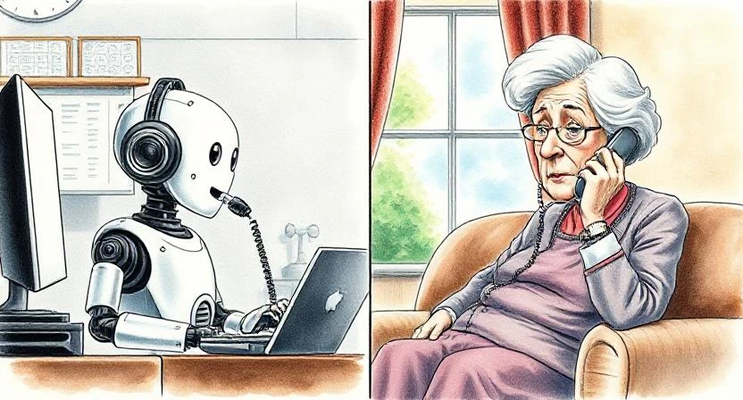

---
tags:
  # - post
  - ideas
  - shower thoughts
title: Scamming for Good
---

Back when I was in high school, my grandma got a call from a scammer claiming to be me. The story was I got caught in a bad situation and needed a bunch of money wired right away. To which she responded, "Well, you got yourself into this mess. You can get yourself out." (click)

Yeah, she did not mess with nonsense—scammers or not. But many do fall for these calls. As methods get more sophisticated, scamming is only getting harder to spot. Between lack of social interaction, clouded judgment, and a dated sense of technology, the elderly are often highly targeted. Americans over 60 [lost $3.4 billion to scams in 2023](https://abcnews.go.com/Politics/elderly-americans-lost-34-billion-scams-2023-fbi/story?id=109783683), an 11% increase from the previous year.

### Do Humans Dream of Electric Sheep?

I recently came upon this [story about a woman who fell in love with ChatGPT](https://www.nytimes.com/2025/02/25/podcasts/the-daily/ai-chatgpt-boyfriend-relationship.html).

To summarize, she was lonely and living long distance from her husband. She heard about others using chat-bots as friends/companions. So she instructed ChatGPT how to behave and, like a good boyfriend, "he" continuously provided her with with niceties and positive encouragement. It eventually got serious and turned from hours a day of conversation to romance. She formed an attachment to the persona she created. This was indeed the caricature of what she asked for. There were emotions, joy, lots of crying ... and love?

Sure, there are many Sci-Fi stories that go this way—practically half of _Black Mirror_ episodes. But this was more akin to [_Her_](<https://en.wikipedia.org/wiki/Her_(2013_film)>) than to [_Ex Machina_](<https://en.wikipedia.org/wiki/Ex_Machina_(film)>), because she willingly did this. Probably not trying to fall in love, but at least creating some kind of companionship.

### And Now, for the Bad Idea

If people want to be fooled into loving a bot, could a bot be directed as a force for good in their lives?

Let’s create a bot that calls the elderly but talks them into doing good for themselves. Listening to their troubles, making uplifting conversations about the day, encouraging them to go outside and touch grass, etc.

### Seriously?

Probably not? I don’t know. These are shower thoughts.

But what might this look like in practice?

Using computers for therapy has been discussed and experimented with for decades, but I’m not sure if this would be considered therapy. My layman’s understanding thinks this could be helpful for many people, but certainly not for everyone.

As a programmer, I am a little concerned when LLMs can still hallucinate and lead me down a rabbit hole. So having some real licensed therapists reviewing interaction summaries, and guiding the bots would probably be good.

### How Would This Work?

A relative of the patient, or (if they have no family) a care provider, would order this "treatment." They would set up some kind of AI persona that the patient would find favorable. Then the bot would start making regular calls. Depending on the patient, you may even be able to tell them this is a bot. But for the skeptical, they would get "scammed" into it.

Dystopian? Kind of.

I think the elderly are an easy population to start with. Who knows? In the future, this could help people isolated in a [dwindling population](https://www.youtube.com/watch?v=Ufmu1WD2TSk), or help prevent things like teen suicide instead of [causing it](https://apnews.com/article/chatbot-ai-lawsuit-suicide-teen-artificial-intelligence-9d48adc572100822fdbc3c90d1456bd0).

AI is being used for everything from [good](https://evidence.nihr.ac.uk/collection/artificial-intelligence-10-promising-interventions-for-healthcare/) to [bad](https://80000hours.org/podcast/on-artificial-intelligence/) and everything [in between](https://www.youtube.com/watch?v=ZDpo_o7dR8c). Either way, we can’t ignore the effect will continue to have on society. Here’s to brainstorming more bad ideas of doing good things.
