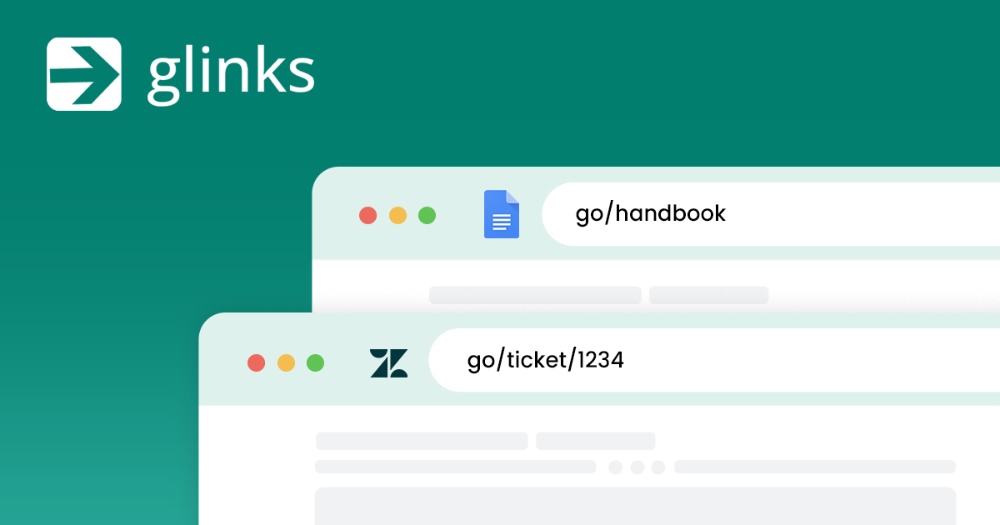

---
tags:
  # - post
  - tech
title: Using proprietary golinks in Firefox
---



When I start a new job I often spend the first day bookmarking all the important sites we use (email, ticketing, reporting, documentation, hosting, etc).

At my new place of employment, they rely on [go links](https://meta.wikimedia.org/wiki/Go_links). Not my favorite tech, but it is an interesting alternate soultion to my bookmarking workflow. Go links have been around for decades and there are a ton of implementations, including [my favorite one from Tailscale](https://tailscale.com/blog/golink) for in-network use.

At work, we rely on go links quite a bit. They are mentioned verbally in meetings and are linked to in many documents. Unfortulately, the service they use, [glinks](https://getglinks.com/), is not very functional if you are not using their [Chrome extension](https://chromewebstore.google.com/detail/glinks-go-links/gciegpagokgfonmlmdecellbnhgebdlf).

As a longtime Firefox user and lover of freedom I generally avoid Chrome (someday I should write a post about this since there aren't enough already :grin:). I am often able to work around proprietary Chrome solutions by creating bookmarklets. So I created a hacked solution using [Bookmark Keywords](https://kb.mozillazine.org/Using_keyword_searches), but it required some manual intervention to work for each link.

Then I started creating a very basic extension that would do this for me. But I figured out an easier way. It gives the same experience as it does for Chrome users, and it is a general purpose solution that can be used for other similar services (and browsers perhaps).

Here are the exact instructions:

1. Log into getglinks.com

2. In Firefox go to about:config and add the following new value:

> browser.fixup.domainwhitelist.go = true

3. Install the Redirector extension

4. In the extension settings create the following rule:

```
   Redirect: http*://go/*
   To: http://getglinks.com/r/$2
   Example: http://go/something
```

Now you should be able to type in go links (ie - go/data and go/dashboard) and click them in documents. Go for it.
