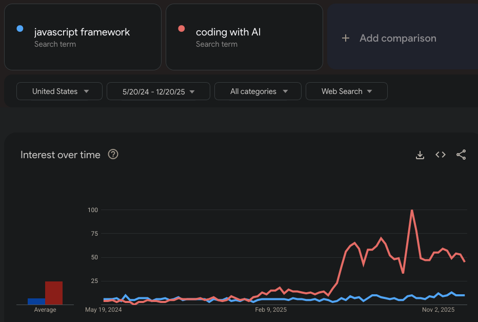

---
tags:
  - tech
title: Thoughts on LLM use from a programming junkie
---

I am an addict. No joke.

After a full workday of writing code, I come home and hack on side projects. It's not healthy and I’m the first to acknowledge it. This is a real addiction, but is not taken seriously since its seen as “one of the good ones”.

What’s changed recently isn’t how much I build, but _how_ I build.

For builders, there is that dopamine hit when many hours of effort turns into something that works. But now those hours can be compressed into minutes with almost no effort. All the dopamine you could ever want.

But I’m not here to talk about addiction.

# Waiting used to be optional

Discovering Linux and open source was a revelation to me when I was younger. The idea that most of the world’s software was freely available, constantly improving, and instantly accessible felt almost unreal.

My father was an architect. He would spend months — sometimes years — designing buildings, and only much later see the result. I couldn’t imagine waiting that long to experience the payoff of my work.

I see a similar dynamic with my kids. They build and rebuild the same LEGO sets, but the desire for the *next* thing is always there. Once you’ve assembled everything you own, you have to wait — or save — before you can build something new.

Software removed waiting. The internet was an endless playground of toys to try. That immediacy shaped how I learned, how I worked, and what I found satisfying.

# New builders, new entry points

One of the great things LLMs have done is empower non-developers. People can now build tools for their own needs without years of training, and you don't need to be a super nerd like me.

I love seeing what this new community has come up with, even if that [accessibility may not last for ever.](https://80000hours.org/podcast/episodes/toby-ord-inference-scaling-ai-governance/)

# The journey is shrinking

For me, programming used to be mostly about the journey. I would make incremental changes, hit dead ends, rethink abstractions, and slowly converge on something solid. We love to solve puzzles.

Lately, I spend more time iterating on design documents with an LLM than writing code directly. The destination is cheap, so the journey matters less. That’s especially tempting for things I’ve built so many times before (auth flows, CRUD APIs, server caching).

I get more done, but I spend less time _thinking in code_.

# Making beautiful code or an elegant abstraction

I have tried being very descriptive to the LLMs about how I want my code to be written, but it can only get you so far. And why bother? The better these tools get, the less time I spend actually looking at the code itself.

You can spend a lot of time curating you Claude hooks, skills, tweaking tests runners, etc. But these are just stopgaps while Claude gets smarter with each release. In a few months' time no one will be context hacking as these models get smarter than us seasoned engineers.

At the time of this writing I am using Opus 4.5 and it needs dramatically less hand-holding then its predecessors.

# Productivity and its cost

I’ve shipped more side projects in the last couple of years than ever before. I don’t even write ideas down anymore — I can spin up a discussion with Claude Code Web and pick it up later on my phone when walking the dog.

That acceleration has pushed me toward building more feature-complete apps. On a [recent project](https://github.com/jonocodes/stashcast), I was so satisfied with its performance that I had it translate the entire application into multiple languages. I am the only user. I only speak one language.

The downside is cognitive. When you have a cloud of minions waiting to execute your every command, downtime can feel outright senseless. Managing parallel agents and half-started ideas takes real mental space. Productivity becomes [something you have to manage](https://www.tabulamag.com/p/too-fast-to-think-the-hidden-fatigue), not just enjoy. 

This kind of productivity has a different cost profile than manual work.

Any developer who’s become a manager knows the feeling: distance from the code reshapes how you think. I’m learning new skills, but spending less time in syntax and implementation can _feel_ like a kind of intellectual atrophy — fewer sharp edges, less resistance. At the same time, this new over-productivity feels almost greedy.

# Innovation for humans?

I feel less excited by new languages or frameworks than I used to, possibly because I spend less time reading and writing code directly. If humans stop being the primary audience, it’s unclear what happens to ergonomics, fun, or beauty as design goals.

It is kind of funny to think our future super-intelligent AI may still be programming on ancient 21st century technology. Forget Python 4. We can work around anything with just pseudocode.

What language innovations do I see these days? LLM focused ones that __focus__ on using string compression to deal with limited context windows. This is early days, so I don't find this terribly interesting.

I think LLMs would do better creating their own i-code that makes the most sense to them. Maybe its all [Sanskrit and emoji](https://experiencemachines.substack.com/p/machines-of-loving-bliss). Who knows.

At some point, LLMs became generally _good enough_ at writing programs. And that’s fine.

Early in your career, it’s natural to obsess over unnecessary details — naming, structure, theoretical purity. Over time, you learn a different lesson: most of the code you write will be replaced in a year or two anyway. Given that reality, “good enough” isn’t a failure of standards; it’s an acknowledgment of impermanence.

# Whats next for us?

There have always been programming hobbyists who don't do it for their job. They are the minority, but not for long.

I have been so lucky to have a career where I get paid for doing what I love. And its been an honor to work at some great companies. These days at work I am getting pull requests from non technical co-workers.

Sure the product manager can't run our stack or knows what a unit test is, but he can fire off an agent to make changes to widgets or even vibe code a whole new product idea. And why not? Much of this is boiler plate grunt work we would rather not do anyway.

There will be professional programmers for a while yet, but fewer and fewer will be needed or employable.

What a blow it will be when it is taken away from us. I guess we will join the other droves of white collar workers being forced into an early retirement. I'll still be happily coding away, but my run of making a living from it will have run its course.
