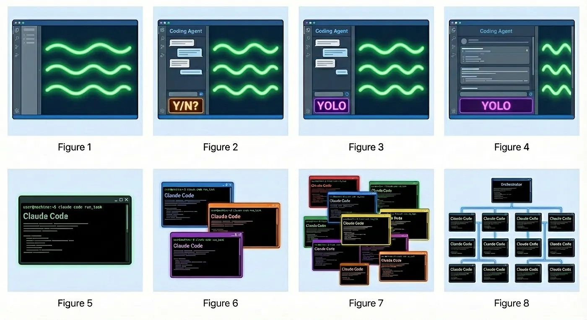
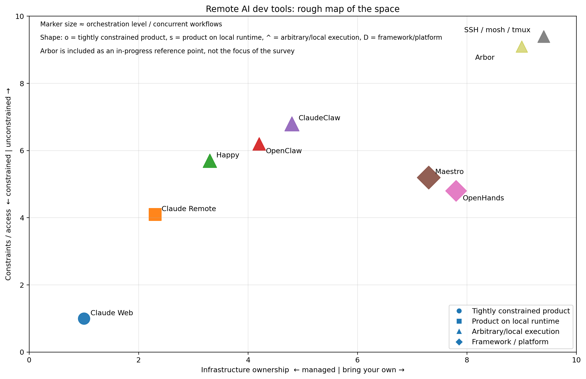
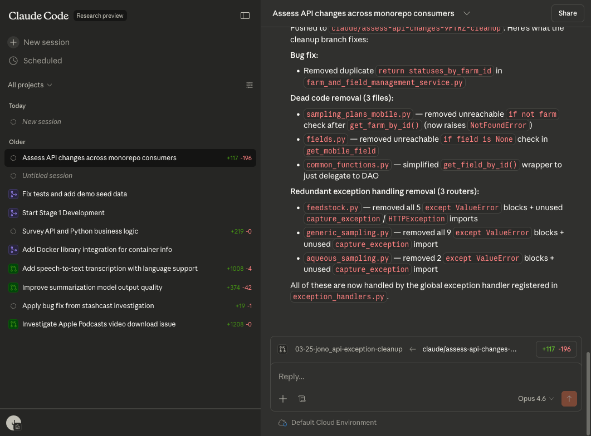
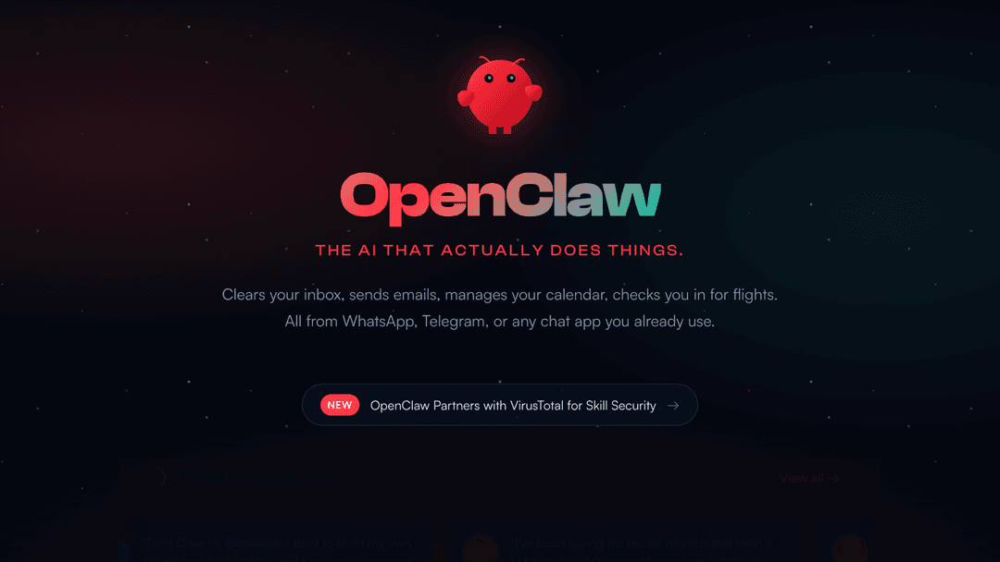
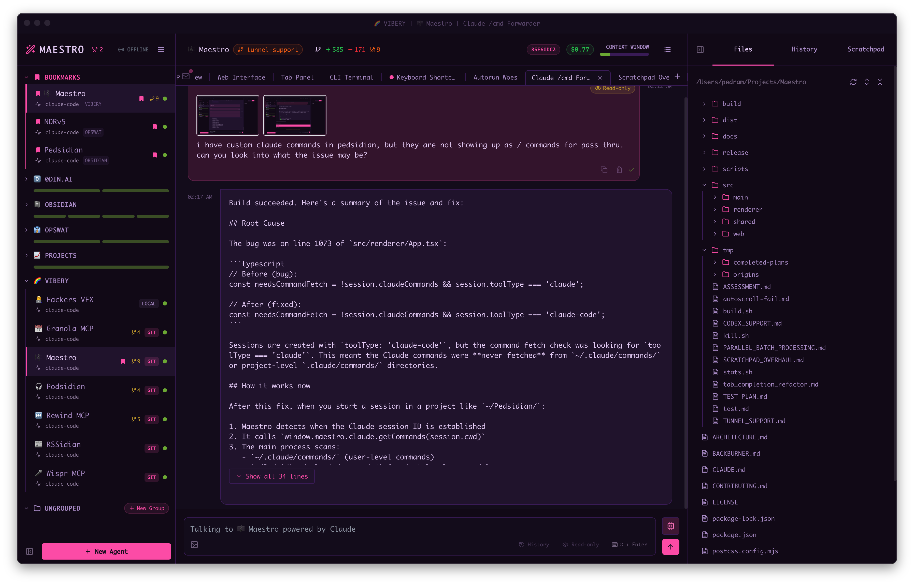
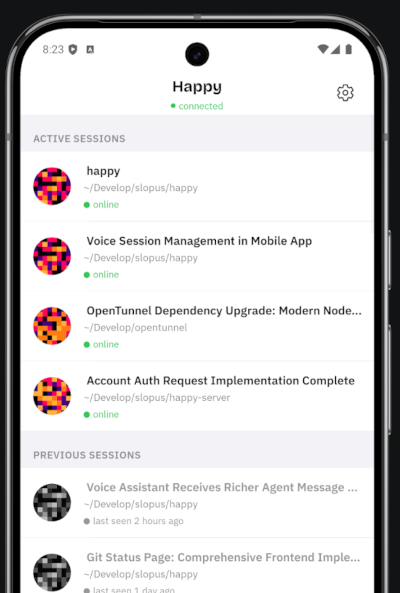
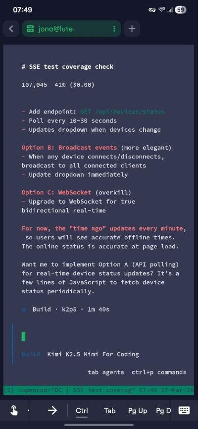
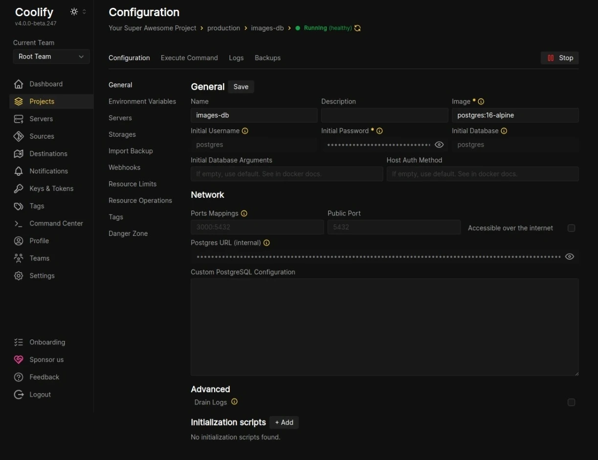

---
tags:
  - tech
title: Trends in Ambient Development
---

I have always been somewhat fixated on developer experience, and will often go way overboard trying to optimize my daily workflow. While working at Udemy, I starting the Local Dev Guild, where we all got to nerd out on this stuff. I was maybe a little too into it.

The "IDE" for developing with AI is having a fascinating renaissance right now, so I have been exploring some of these new tools for my day to day work.

In this new LLM world, we are becoming terribly productive. Here are some of the projects I cooked up just in the past month or so.
* [StashCast](https://stashcast.net) - Custom podcast feeds that collect whatever specific media you want to listen to later
* [HubSnub](https://github.com/jonocodes/HubSnub) - Taming github email notifications
* [LinkHop](https://github.com/jonocodes/LinkHop) - Messaging between your browsers/devices
* [NewsLoupe](https://github.com/jonocodes/newsloupe) - Customized Hacker News feed based on your ongoing interests.
* [Arbor](https://github.com/jonocodes/arbor) - A browser based/LLM agnostic control pane for remote development

We need tools to manage many projects and many features, being continuously developed, by a single person. This is the new IDE I'm talking about. I like to call it "Ambient Development", since it is something you jump in and out of. Sometimes tweaking a bunch of features and tests. Sometimes just nudging in a new direction. The agent takes over and continues on your theme while you go about your business. Maybe somewhat like vibe coding, but at a higher dimension?

## So many agents

A lot of the talk around AI coding still assumes a pretty simple setup: you open a chat, paste something in, get something back.

That is not where things are going.

What’s starting to show up now is a different kind of system. Not just a coding assistant, and not quite a new IDE either, but something closer to a control plane for the development environment itself: agents running for a while, tools exposed remotely, state that persists, and the ability to check in from a phone, browser, or terminal.

This post is a survey of that space while it is still taking shape. There are many tools that are sprouting up everyday to suit people's personal needs. Here, I am looking at only several of them. Things are moving fast so this post will almost certainly not be relevant past March 2026.

Some of these tools are polished products. Some are one-man, open-source side projects. Some are really just thin layers over SSH. A few feel like early glimpses of a new IDE category altogether.

I’m not trying to make a definitive ranking here. The space is moving too fast for that. I mostly want to map the terrain, say what I am actually looking for, and explain why I think this category is going to matter.

There’s also a recent precursor to all of this in long-running agent like the [Ralph loop](https://ghuntley.com/ralph/) or the highly over-engineered [Gastown](https://steve-yegge.medium.com/welcome-to-gas-town-4f25ee16dd04). That work matters, but I think the newer thing is slightly different: less about making agents autonomous in the abstract, more about making them usable inside a real development setup.

(image from Gastown blog)

## What I’m looking for

Before comparing tools, it helps to be clear about what I want.

### My environment is the source of truth

If it can’t run my actual stack, it’s not very useful.

That means Docker, local services, credentials, and long-running processes.

This is where most cloud-based tools start to break down.

### I want to control it from anywhere

Phone, browser, laptop. Not just read logs, but actually interact with it.

### I want long-running agents

Not just chat.

I want to kick off a task, leave, come back later, inspect what happened, and continue.

### I want freedom of execution

With something like SSH + mosh + tmux, I can run Claude Code, OpenCode, custom scripts, Docker, or anything else.

Some tools are interfaces. Some are environments. SSH is neither — it’s just access.

### I care about infrastructure ownership, but I don’t treat it as a pro or con

Some tools are managed and session-based. Others expect bring-your-own infrastructure, API keys, and model setup.

That’s not really a simple good/bad distinction. In practice it’s a tradeoff between convenience and control. I tend to like having the option to own more of the stack.

### I want flexibility over polish

I’d rather have something slightly rough that bends to my workflow than something polished but constrained.

## A quick precursor: long-running agents

Before these remote control tools showed up, there was an earlier wave of experiments around long-running agents.

Projects like Ralph loop and Gastown explored the idea that an agent shouldn’t just respond to prompts, but should run continuously — executing tasks, reflecting, and iterating in a loop.

Those systems weren’t mainly about remote control or multi-device access. They were about persistence.

What’s changed recently is not the idea of long-running agents, but how they’re integrated into real development environments.

Tools like OpenClaw and ClaudeClaw build on that idea, but add something new: a way to control and supervise those agents from anywhere.

If the first wave was about making agents autonomous, this wave is about making them usable.

## Mapping the space

Rather than listing pros and cons, it’s more useful to map these tools across a few dimensions.

The most important ones I’ve found are:

* Infrastructure ownership — managed vs bring-your-own
* Constraints / access — how restricted the system is (API keys, model lock-in, sandboxing)
* Execution freedom — sandboxed vs full environment
* Orchestration level — single agent vs many

Most tools aren’t competing on features so much as choosing different points in this design space.

### What “constraints” means

This combines a few things that tend to show up together:

* Do you need to bring API keys?
* Are you locked to a specific model?
* Are you running inside a sandbox?

At one end:

* Claude Web — fully constrained (sandbox + single model)

At the other:

* SSH / Arbor — no constraints at all

Everything else sits somewhere in between.

Rather than listing pros and cons, it’s more useful to map these tools across a few dimensions.

Some interesting ones to me are:

* Infrastructure ownership — managed vs bring-your-own
* Control style — interactive vs detached
* Execution freedom — sandboxed vs full environment
* Orchestration level — single agent vs many

Most tools aren’t competing on features so much as choosing different points in this design space. Here is a crude AI generated mapping of constraints and control.

### Feature comparison (quick scan)
---

| Tool            | Requires API keys | Model constraint                | Execution freedom            | Remote control surfaces    | Multi-agent | Notes                       |
| --------------- | ----------------- | ------------------------------- | ---------------------------- | -------------------------- | ----------- | --------------------------- |
| Claude Web      | ❌ (session)       | Claude only                     | ❌ sandboxed                  | Web                        | ❌           | Cannot run Docker-in-Docker |
| Claude Remote   | ❌ (session)       | Claude only                     | ⚠️ local but via Claude Code | Web, Mobile, CLI           | ❌           | Single-session oriented     |
| OpenClaw        | ✅                 | Multi-model                     | ✅ full local                 | Chat (Slack/Telegram), Web | ⚠️          | Detached workflows          |
| OpenHands       | ✅                 | Multi-model                     | ⚠️ depends on setup          | Web/CLI                    | ✅           | Framework-like              |
| Maestro         | ✅                 | Multi-model                     | ⚠️ depends on setup          | Desktop/Web                | ✅           | Orchestration-focused       |
| Happy           | ❌ (session)       | Mostly Claude (via Claude Code) | ✅ full local                 | Web, Mobile                | ✅           | Multi-session; open source  |
| SSH (mosh/tmux) | ❌                 | None                            | ✅ arbitrary (anything)       | Any SSH client             | ✅           | Baseline; no AI layer       |

**Notes on columns**

* *Requires API keys*: whether you must bring your own keys/billing vs using a logged-in session.
* *Model constraint*: whether you’re locked to a specific model/vendor.
* *Execution freedom*: can you run arbitrary tools (Docker, services, custom scripts), or are you sandboxed.
* *Remote control surfaces*: where you can drive the system from.
* *Multi-agent*: ability to run multiple concurrent agents/workflows.

A key distinction for me is **arbitrary execution**:

> With SSH (and anything built on top of it), I’m not constrained to a specific AI tool at all. It’s just a terminal. I can run Claude Code, OpenCode, custom agents, or no AI at all.

Some systems are tightly coupled to a model or runtime. Others let you treat AI as just another tool in the environment.

## The tools

### Claude Web
https://claude.ai/code

A zero-setup, cloud-hosted coding environment.

**What it does well**

* instant access
* clean UI
* no setup

**Limitations**

* runs in a sandboxed container
* cannot run Docker inside Docker
* no access to the real local environment

**For me**

This works fine for quick tasks, but breaks down pretty quickly for real development work. I tend to use this for research, and first passes on coding a new feature.

If the workflow depends on local services, it’s a non-starter.

### Claude Remote
[https://docs.anthropic.com/en/docs/claude-code](https://docs.anthropic.com/en/docs/claude-code)

The official way to control Claude Code from web or mobile.

**What it does well**

* seamless device switching
* native mobile support
* polished experience

**Limitations**

* ==single-session oriented==
* Claude-only
* limited orchestration

**For me**

This feels like remote desktop for an AI session. Very clean. But it doesn’t go much beyond that.

### OpenClaw / ClaudeClaw / NanoClaw / NemoClaw
https://openclaw.ai/

An async, programmable control layer for Claude Code and related workflows.

**What it does well**

* trigger work remotely through chat or control surfaces
* detached workflows
* open source
* active project (top 10 most starts in github) with tons of plugins 

**Limitations**

* less interactive
* less visibility
* more setup
* rougher UX
* not specific to coding to tasks

**For me**

This feels less like a UI and more like a control plane.

### OpenHands
[https://github.com/OpenHands](https://github.com/OpenHands)

An open-source attempt at a more general agent runtime.

**What it does well**

* flexible
* model-agnostic
* ambitious scope
* active development and community

**Limitations**

* hard to get working in practice
* unclear workflow
* feels more like a framework than a tool
* requires API key

**For me**

I spent some time trying to use OpenHands and didn’t get very far. It seems to be aiming at something important, and it think it may be more promising down the road.

### Maestro
[https://runmaestro.ai/](https://runmaestro.ai/)

A multi-agent orchestration environment.

**What it does well**

* multiple agents running in parallel
* agent to agent communication
* long-running workflows
* model flexibility (Claude Code, Codex, and OpenCode)

**Limitations**

* more infrastructure setup
* less mobile/remote-first
* feels more like infrastructure than a personal tool

**For me**

Conceptually this is one of the more interesting systems, even if it doesn’t line up exactly with what I want day to day.

### Happy
[https://github.com/slopus/happy](https://github.com/slopus/happy)

An open-source remote control layer for Claude Code - but can also support other models.

**What it does well**

* strong PWA for both mobile and web
* multi-session support
* no API keys required
* open source

**Limitations**

* still mostly tied to Claude
* community has slowed down - I have submitted issues and PRs and got no response

**For me**

This feels like one of the more compelling points in the space because it keeps the power of local execution and adds a usable remote interface.

# Cloud CLI (aka Claude Code UI)
https://github.com/siteboon/claudecodeui

Open source control for a server that ties into multiple AI providers, and access their history.

**What it does well**

* nice looking mobile/web experience
* runs in local network, so you can choose your security model. less infra then Happy
* it scrapes all your local session, so you can read them from even before you installed CloudCLI
* can even continue old sessions from way back
* no API keys required, multi model (Claude, Codex, Gemini)
* open source
* file manager, git viewer, shell (though this is not bash, its just a terminal version of the LLM agent)

**Limitations**

* you run one instance between hosts, so its hard to jump around hosts
* a bit buggy: mobile hand off does not work well, commands like "/clear" dont seem to work, [running the shell does not always work](https://github.com/siteboon/claudecodeui/issues/372), [claude subscription login was confusing](https://github.com/siteboon/claudecodeui/issues/547)

**For me**

This has a lot of the features I want, but I could not get it to reliably work on mobile. I think most of the issues are around scraping the shell into the web app, but they can be worked out.

### SSH (mosh + tmux)
https://mosh.org/

The baseline everything else is competing with. 

**What it does well**

* complete control
* unlimited flexibility
* works everywhere

**Limitations**

* no built-in AI abstractions
* manual setup
* no unified UX

**For me**

This is ==still the most reliable option==. Everything else is layering something on top of this, whether explicitly or not.

**Instructions**

Since you can roll this however you want, here is the setup that works well for me. It requires several components but they are fairly simple:
* A computer that is always on - Desktop/laptop/server
* A good ssh client - I use Android so the best thing for this case has been Termius since it has built in mosh, session control, and customizable keys.
* Mosh - This is often build into mobile ssh agents, but on desktop it is its own command. [Mosh](https://mosh.org/) makes sure your long running shell connections are resilient to connectivity issues. It means you can turn off your phone, turn it on again, and continue communication. This needs to also be installed on the computer, not just the phone.
* Tmux (or screen) - This is for session management. So you can run many terminal sessions on your server and enter them from all your devices. It also helps with some scrolling issues introduced by mosh. This only needs to be installed on the computer, not the phone.
* Tailscale (optional) - For tunneling securely to all my devices.

## Why I started building my own
https://github.com/jonocodes/arbor

After trying these, I started sketching out my own version of this: Arbor.

It’s still very early, more of a spec than a system, but the direction is clear.

What I want is a persistent local agent runtime that can be controlled remotely, has full access to my environment, and keeps a clean separation between execution and control.

At a high level:

* agents run locally against the real environment
* there’s a control layer I can access from phone, browser, or anywhere else
* tasks are long-running and resumable
* everything is inspectable

Most tools I’ve tried optimize for one of interaction, orchestration, or flexibility, but not all three.

What I’m aiming for is something closer to a lightweight control plane for the dev environment.

Not a new IDE. Not a giant framework. Just something that lets me start work, leave it running, check in from anywhere, and intervene when needed.

## How this pairs with other tools

This kind of setup doesn’t exist in isolation. I can deploy it along side other tools, or do some minimal integration. For example it would be nice to see a running preview of what the running project looks like.

### Coolify

Coolify is interesting here as the deployment side of the loop, particularly for web apps. If agents can push changes, something like Coolify can expose feature deployments and previews quickly. I love, love, love this project. It is kind of like Vercel in that it provides a web interface for managing deployments, and can auto deploy services from pull requests. But it is self hosted, and more importantly it is full stack (Vercel is more stack restricted). I just make sure there is a docker-compose file in each project, and coolify will spin up all the dependent services and databases for every branch. Brilliant.

This probably deserves its own blog post since I did a deep survey of other tools, and bringing it up is not trivial, especially with my NixOS setup.

### Version Control

One thing that still feels oddly missing is a good web-based git and code review interface.

I still can’t quite believe there isn’t a great web git client here yet. There are many git services, just not clients where I can do standard things like review, staging, merging, etc.

That feels like an obvious missing piece in this stack: agents can generate changes, but reviewing them remotely is still awkward.

So far the best I have seen is Cloud CLI. They have a very nice built in file and versioning interface. I wish it were more standalone so it could be simply imported elsewhere.

Also I've been meaning to experiment more with VS Code Web since it has a nice git client, and a bunch of other things that may be useful here.

## The real tradeoffs

These tools aren’t better or worse in some absolute sense. They’re making different choices.

**Infrastructure ownership**
Managed systems are simpler. Bring-your-own systems are more flexible.

**Execution environment**
Cloud tools are easy, but constrained. Local tools have more fidelity to the real environment.

**Control style**
These are all asynchronous at the core. The more useful distinction is whether they are interactive-first or detached-first.

**Execution freedom**
If I’m going to trust an agent to modify code, I need to be able to run and verify anything it does. That rules out a lot of sandboxed setups.

**Orchestration**
Single-agent systems are easier to understand. Multi-agent systems are more powerful, but add coordination overhead.

## Where this is all going

The shift isn’t just from writing code to prompting models.

It’s from interacting with tools to managing systems.

The development environment is becoming something that runs continuously, with agents working in the background, and with control surfaces exposed across phone, browser, chat, and terminal.

Right now, we have agents that can write code, but we don’t yet have a clean way to live with them.

That, more than model quality, feels like the actual frontier here.
